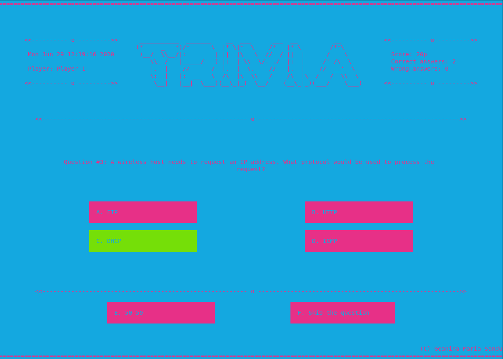

# Trivia

## Introduction 

The following repository displays my personal approach of the classic Trivia game, designed as part of the *C Programming* course of my first year of Computer Science curriculum (2018-2019). The code I wrote back then was very bad, but the game design was interesting, so I decided to refactor it, after acquiring some more experience with programming.
The program consists of a command line game, implemented using the **ncurses** library over the C language.

## Integration

The program requires the installation of the *ncurses* library. This can be installed by issuing the command:
```sh
$ sudo apt install libncurses5-dev libncursesw5-dev
```

## Compiling

As the repository contains a Makefile, the game can be compiled using the **make build** command. To run the program, use the **make run** command.

## Implementation

#### Menu

The game starts by displaying the main menu, where the player can choose between a series of options:
* *New Game* - begin a new game;
* *Resume Game* - resume the previous game if the user returned to the menu before finishing the ongoing game;
* *Scoreboard* - show a list of the highest 10 scores;
* *Quit* - close the game window and return to the terminal.
 

#### Game window

Upon choosing the *New Game* option, the player is prompted with a window asking for their name. After receiving the name, the program opens the game window, which contains the current question and its answer options.

The user can pick one of the four answers by pressing a key (**'a', 'b', 'c', 'd'**). The box corresponding to the selected answer changes its highlight color to yellow. After 1 second, one of the following scenarios can happen.
* If the selected answer was **correct**, the box gets highlighted in green;
* If the selected answer was **wrong**, the box gets highlighted in dark red and the correct answer turns green.

After another 1 second, the game continues to the next question, until all the questions (stored in the *questions.txt* file) have been answered or the user has pressed the **'q'** button, which takes them back to the main menu. After returning to the menu, the player can choose the **Resume Game** option to continue the game from the last question.

The score, as well as the number of right and wrong answers is displayed in the *score panel*, which can be found on the right side of the screen. The game rewards the player with **10p** per right answer and penalizes them with **-5p** per wrong answer.
The current date and time and the player name are shown in the *time panel*, found on the left side of the screen.





#### Helping options

If the player doesn't know the answer of one question, they can choose one of the two helping options:

* *Fifty-Fifty* (**'e'**) - the game hides two of the wrong answers randomly;
* *Skip the question* (**'f'**) - the current question is skipped, without affecting the player's score.

Each of the helping options is **available only once during a game**.

#### Scoreboard

At the end of each game, the player score is added to the *scoreboard.txt* file, where the scores of each user are persistently stored. The player can choose the **Scoreboard** window, which displays a list of the 10 highest scores from the whole game history.